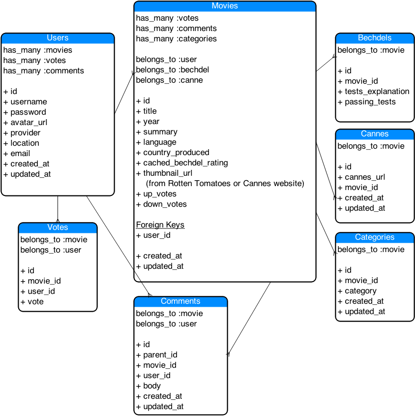

## The Bechdel Test

### About the Bechdel Test
[From Wikipedia:](http://en.wikipedia.org/wiki/Bechdel_test)
The Bechdel test asks whether a work of fiction features at least two women who talk to each other about something other than a man. The requirement that the two women must be named is sometimes added. Many contemporary works fail this test of gender bias. On average, films that pass the test have been found to have a lower budget than others, but of comparable or better financial performance.

The test is named after the American cartoonist Alison Bechdel. In 1985, she had a character in her comic strip Dykes to Watch Out For voice the idea, which she attributed to a friend, Liz Wallace. The test was originally conceived for evaluating films but has since been applied to other media. It is also known as the Bechdel/Wallace test, the Bechdel rule, Bechdel's law, or the Mo Movie Measure.

###About this Web Application

This web app will be built using Rails, Test Driven Development using capybara and rspec, jQuery, and the Refills CSS framework.

###My Entity Relationship Diagram

